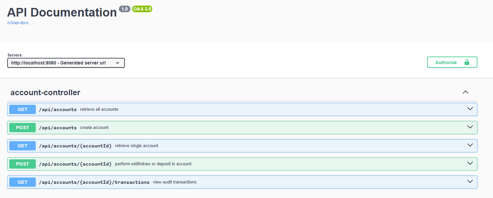

# Account Management API

This is a RESTful API for managing bank accounts and transactions. It allows users to create accounts, deposit, withdraw, and view transactions associated with their accounts.

## Table of Contents

- [Introduction](#introduction)
- [API Endpoints](#api-endpoints)
- [Error Handling](#error-handling)
- [Technologies Used](#technologies-used)
- [Setup and Installation](#setup-and-installation)
- [License](#license)

---

## Introduction

The API provides a set of endpoints to manage and perform operations on bank accounts. It supports basic banking operations, such as creating an account, making deposits and withdrawals, and retrieving account information and transaction history.

---

## API Endpoints

The following table describes the available API endpoints.

| HTTP Method | Endpoint                        | Description                                          | Request Parameters                            | Response Type              |
|-------------|----------------------------------|------------------------------------------------------|-----------------------------------------------|----------------------------|
| `POST`      | `/api/accounts/{accountId}/deposit`   | Deposit money into an account                       | `accountId` (Path), `amount` (Query)          | `AccountDto`               |
| `POST`      | `/api/accounts`                  | Create a new account                                | `initialBalance` (Query)                      | `AccountDto`               |
| `POST`      | `/api/accounts/{accountId}/withdraw`  | Withdraw money from an account                      | `accountId` (Path), `amount` (Query)          | `AccountDto`               |
| `GET`       | `/api/accounts/{accountId}`      | Get details of a specific account                   | `accountId` (Path)                            | `AccountDto`               |
| `GET`       | `/api/accounts`                  | Get all accounts                                    | None                                          | `List<AccountDto>`         |
| `GET`       | `/api/accounts/{accountId}/transactions` | Get all transactions for a specific account         | `accountId` (Path)                            | `List<TransactionDto>`     |

---

## SWAGGER 

Swagger documentation available in : http://localhost:8080/swagger-ui/index.html

